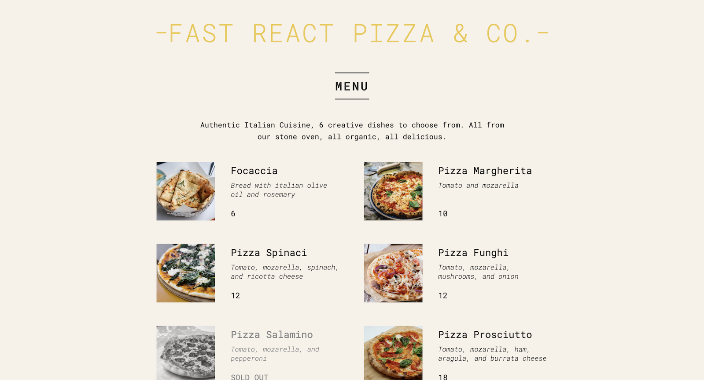

<div style="padding: 50px">

<h1 align="center">Pizza Menu</h1>



<h2 align="left">Scaffolding React App</h2>

* Create react app

```bash
npx create-react-app@5 pizza-menu
```

When creating a React app using `create-react-app`, the default entry point for the application is the `index.js` file located in the `src` folder. This is because create-react-app is pre-configured with `Webpack`, a module bundler that handles the bundling of JavaScript files and other assets. Webpack expects an entry point module called `index.js` by default.

* Start the app [**`@ http://localhost:3000`**](http://localhost:3000)

```bash
npm start
```

</div>

